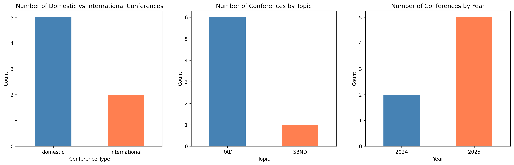

2026-02-05

# 2026 Winter

## JINST Submission
* Anticipate a reply from the editor around the end of February  
* 4 weeks for a major revision, 2 weeks for a minor revision  
* Ask for an extension while Georgia is on leave?

## RAD
* Focus on implementing the current model on the GPU server for ICEBERG  
* Restart the FPGA investigation in mid or late summer?  
    * Possibility to work with Sunny's group on this (if they are willing), as they have a model that has been more thoroughly studied with labeled data for specific cases (SN vs. radiological background)

## NC Delta
* SBND policy requires **“Preliminary”** (not “Work in Progress”) results for the Neutrino poster  
    * `aka note plus plots at a mature stage` (Afro)  
    * `with some sort of data–MC comparison` (Sungbin)  
* Final version due 1 month before the conference (late May)

### 1g1p
* Should be relatively easy to produce a delta mass plot for data–MC comparison  

### 1g0p
* Corresponding variable for delta mass?  
* See technote regarding “reconstructed” delta mass  
    * Could consider using various shower kinematic variables that are important in the BDT  

* Finalize selection for NC (including 1gMp) by the end of summer  
    * Depends on the production of dedicated samples; currently waiting for PR approval for the GEN `fcl` to `sbncode`

## Conferences

### 2024
* New Perspectives (RAD)  
* CPAD (RAD)

### 2025
* APS (SBND – mCP, Travel Support from GSAS)  
* AD4HEP (RAD)  
* Users Meeting (Poster, RAD, Travel Support from URA)  
* NPML (Japan, RAD, Travel Support from Conference)  
* CTD (Japan, not presenting, Travel Support from Conference)

### 2026
* NPML (Irvine, RAD, early July)  
    * Would participate in the satellite workshop if it is related to a tutorial for LArTPC/WCh open data; otherwise, skip  
    * Would present on RAD at ICEBERG if possible; otherwise, with no major RAD updates using uB, could consider not participating this time  

* Neutrino (Irvine, Poster, SBND – NC Delta, 06/22–06/26)  
    * See notes for `NC Delta`

* NuFact (China, SBND – NC Delta, 08/31–09/05)  
    * Could extend results from Neutrino (e.g., focus on showing the 1g1p delta mass peak at Neutrino, then show all three 1gXp channels at NuFact)  
    * Family wedding on 09/05; would consider paying out of pocket  

* NNN (Next Generation Nucleon Decay and Neutrino Detectors) (Korea, mid October – mid November)  
    * More focus on individual experiments; usually one general talk per experiment  
    * Venue close to home (15-minute bus ride); would consider paying out of pocket if it is in mid November  

## Moving to Fermilab
* Current lease ends 05/31  
* Would like to move (or at least have an IL address in the village) a bit early, around mid-May, for paperwork and shipping luggage  

## URA
* Is it possible to have non-continuous periods?  
* Ideally request support for May, July, and August  
    * May: flight and rental car for 1–2 weeks  
    * Housing for all periods
    * ~ $3000 total

## Etc.
* Would like to go to Korea before the summer, around early-mid April (04/04–04/19)
